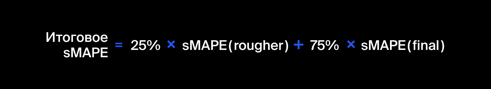

## Задача исследования

Подготовьте прототип модели машинного обучения для «Цифры». 
Компания разрабатывает решения для эффективной работы промышленных предприятий.
Модель должна предсказать коэффициент восстановления золота из золотосодержащей руды. 
В вашем распоряжении данные с параметрами добычи и очистки.
Модель поможет оптимизировать производство, чтобы не запускать предприятие с убыточными характеристиками.

## Инструкция по выполнению проекта

1.Подготовьте данные

  - Откройте файлы и изучите их.
  - Проверьте, что эффективность обогащения рассчитана правильно. Вычислите её на обучающей выборке для признака rougher.output.recovery. Найдите MAE между вашими расчётами и значением признака. Опишите выводы.
  - Проанализируйте признаки, недоступные в тестовой выборке. Что это за параметры? К какому типу относятся?
  - Проведите предобработку данных.

2.Проанализируйте данные
    
  - Посмотрите, как меняется концентрация металлов (Au, Ag, Pb) на различных этапах очистки. Опишите выводы.
  - Сравните распределения размеров гранул сырья на обучающей и тестовой выборках. Если распределения сильно отличаются друг от друга, оценка модели будет неправильной.
  - Исследуйте суммарную концентрацию всех веществ на разных стадиях: в сырье, в черновом и финальном концентратах.

3.Постройте модель
    
  - Напишите функцию для вычисления итоговой sMAPE.

  - Обучите разные модели и оцените их качество кросс-валидацией. Выберите лучшую модель и проверьте её на тестовой выборке. Опишите выводы.

Нам пригодятся формулы метрик качества:

## Описание данных

### Технологический процесс

- _**Rougher feed**_ — исходное сырье
- _**Rougher additions (или reagent additions)**_ — флотационные реагенты: Xanthate, Sulphate, Depressant
- _**Xanthate**_ **— ксантогенат (промотер, или активатор флотации);
- _**Sulphate**_ — сульфат (на данном производстве сульфид натрия);
- _**Depressant**_ — депрессант (силикат натрия).
- _**Rougher process**_ (англ. «грубый процесс») — флотация
- _**Rougher tails**_ — отвальные хвосты
- _**Float banks**_ — флотационная установка
- _**Cleaner process**_ — очистка
- _**Rougher Au**_ — черновой концентрат золота
- _**Final Au**_ — финальный концентрат золота

#### Параметры этапов

- _**air amount**_ — объём воздуха
- _**fluid levels**_ — уровень жидкости
- _**feed siz**_***e*** — размер гранул сырья
- _**feed rate**_ — скорость подачи

### Наименование признаков

Наименование признаков должно быть такое:

    [этап].[тип_параметра].[название_параметра]
    -------------------------------------------
    Пример: rougher.input.feed_ag

#### Возможные значения для блока [этап]:

- _**rougher**_ — флотация
- _**primary_cleaner**_ — первичная очистка
- _**secondary_cleaner**_ — вторичная очистка
- _final_ — финальные характеристики

#### Возможные значения для блока [тип_параметра]:

- _**input**_ — параметры сырья
- _**output**_ — параметры продукта
- _**state**_ — параметры, характеризующие текущее состояние этапа
- _**calculation**_ — расчётные характеристики